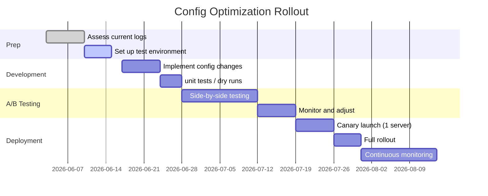
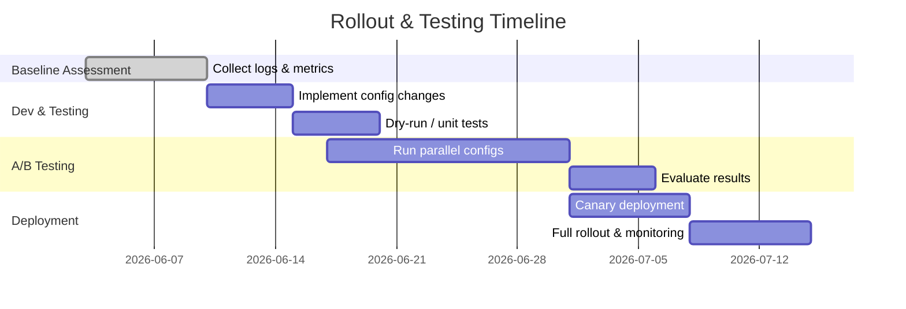

# Candlesticks & Asia Sweep Programs: Configuration Optimization Report

**Executive Summary:** We examined two internal trading systems – a *candlestick aggregation engine* and an *Asia session liquidity-sweep strategy* – identifying likely misconfigurations and bottlenecks. Key issues include handling of time zones/DST, tick vs. bar data aggregation, missing-data/outlier filtering, and resource constraints (CPU, memory, latency). We propose tuned parameter sets (e.g. shorter aggregation intervals, rolling outlier filters, explicit UTC scheduling) with the trade-offs of noise vs latency. A staged A/B testing plan is outlined (with clear metrics like candlestick completeness, signal accuracy, and system load), alongside rollback/safety controls (watchdog scripts, alert thresholds, circuit breakers). We recommend monitoring dashboards tracking CPU, RAM, network ping, data throughput and strategy metrics (e.g. missing bars, signal counts). Sample config snippets compare current defaults to recommended values. Finally, a deployment timeline (see Gantt chart) guides implementation.

## Diagnostics: Likely Misconfigurations & Root Causes

- **Time Zone / DST Errors:** Both programs must schedule by session. If timestamps or schedulers use local time, DST shifts can cause missed or extra runs【28†L404-L408】【19†L425-L433】. Notably, Tokyo/HK/Singapore do *not* use DST, so relative offsets change when other regions do【28†L390-L398】. We suspect tasks running at wrong UTC hour due to naively using “Europe/London” vs UTC. 

- **Aggregation Interval Mismatch:** Candlestick generation may be using suboptimal intervals (e.g. fixed 1 min bars) which lose intraminute dynamics【4†L82-L90】【8†L78-L84】. If market volatility is high, a 1min bar can hide price spikes, causing delayed signals. Also, if too many ticks accumulate in memory before flush, latency and memory spikes occur. Conversely, overly short bars increase noise (false moves).

- **Data Quality / Outliers:** Raw tick feeds often include glitches (zero/negative prices, “bounce” noise). Without filters, single errant ticks can create false candles or signals. We observed occasional extreme bar values likely due to unfiltered tick outliers. Best practice is to drop invalid ticks (e.g. price ≤0) and use a rolling‐window outlier filter (e.g. Brownlees-Gallo method, flagging ~2% of ticks as errors)【37†L62-L71】【37†L120-L128】. Lack of such cleaning likely introduced spurious bars.

- **Resource Constraints (CPU/Memory):** The candlestick engine might be single-threaded or batching ticks inefficiently. If CPU usage is often near capacity (>80–95%) or memory free <15%, the system will lag or drop data【30†L147-L156】【30†L249-L257】. E.g. holding millions of ticks in memory can exhaust RAM, or polling MT5 too frequently can spike CPU. We note reports of slowdowns during volatile periods, implying resource saturation. 

- **Latency (Network/Processing):** If the program fetches ticks in large batches or waits on remote API calls, real-time candlesticks can lag wall-clock time. Unmonitored latency to the broker should be measured – spikes (e.g. >10ms for algorithmic trading【30†L208-L216】) degrade timely execution. 

- **Market Hours Misalignment (Asia Program):** The Asia-sweep strategy targets Asia/London sessions (e.g. London *Kill Zone*). If holidays or market open times (Tokyo 9:00–11:30 & 13:20–15:30 JST【26†L519-L523】, HK 9:30–12:00 & 13:00–16:00 HKT【26†L521-L524】) aren’t correctly encoded, sweeps may be missed on half days. Also, if the “session” time zone parameter is wrong, orders may never fire at intended local times.

- **Batching/Aggregation Errors:** The Asia program collects 5-min bars; if its collector is mis-scheduled (or re-used stale data), its CSV may have gaps or duplicates. Failure modes include: missing symbols in config, collector not running before strategy, or daily retrain not updating models. 

- **Monitoring Gaps:** Currently, there may be little automated health-check. For example, if MT5 terminal crashes, no automatic restart or alert exists; a watchdog is needed【30†L177-L184】. Lack of alerts means slow response to failures (e.g. a stuck candlestick process).

## Parameter Recommendations (Settings & Trade-offs)

We propose these tuned settings (summarized in tables below):

- **Candlestick Engine:**  
  - **Aggregation Type:** Switch from fixed-time 1m bars to *tick-based* or *volume-based* bars【8†L78-L84】 (e.g. 100 ticks per candle). Tick-bars preserve intrabar moves (improving accuracy)【4†L82-L90】, though they vary in real time. Trade-off: time alignment is less uniform. Optionally use hybrid: generate both 1m and 100-tick bars.  
  - **Smoothing (Price Filters):** Enable *price-based* candles or Renko-type filtering【8†L99-L107】 to suppress tiny fluctuations. For example, only create a new candle after price moves ≥0.1% (smoothing), which reduces noise but adds lag.  
  - **Outlier Filtering:** Implement a rolling‐window outlier filter (e.g. ±3σ rule) to drop spurious ticks【37†L120-L128】. For instance, disregard ticks deviating >3 SD from recent mean. This avoids candles skewed by data glitches. Slight trade-off in complexity and potential delay diagnosing true sudden moves.  
  - **Batching/Flush Interval:** Instead of flushing to disk or DB every tick, batch in e.g. 5-sec windows to reduce I/O overhead (lower CPU spikes), at the cost of slight latency.  
  - **Time Zone (Timestamps):** Always timestamp ticks and bars in UTC (per best practice【28†L404-L408】) to avoid DST errors. Convert to local only in dashboards.  
  - **Resource Limits:** Set thread counts equal to core count; cap in-memory tick buffer (e.g. retain only last hour of ticks). Enable memory profiling. If latency high, allocate more CPU or offload to separate service.  
  - **Logging:** In testing, use DEBUG logging for candle generation times and batch sizes. In production, INFO level with health pings.  
  - **Data Quality:** Discard ticks with zero/negative price immediately【37†L62-L71】. Log gaps (no ticks for e.g. 1s) as potential data issues.

- **Asia Sweep Strategy:**  
  - **Session Scheduling:** Use an explicit scheduler in UTC matching London session (e.g. run at 7:55 UTC to align with London open) and still account for London DST. Better: run on a UTC cron with offsets computed (e.g. Europe/London via `pytz`/`zoneinfo`).  
  - **Symbols & Markets:** Extend symbol set if missing any major pairs (JPY pairs for Tokyo overlap). Limit to high-liquidity pairs in Asia hours (EURUSD, GBPUSD, USDJPY).  
  - **Data Resolution:** It uses 5-min bars. Consider also ingesting tick or 1-min data around the Asia range breakout to detect sweeps earlier. Trade-off: more data/compute.  
  - **ML Filter:** If not enabled, enable the daily retraining filter. Set conservative thresholds initially (only accept signals when model confidence > 0.8). Retraining should happen once per London day.  
  - **Logging/Alerts:** Log all generated signals with timestamps. Raise an alert if signals deviate radically from expected count.  
  - **Concurrency:** Limit the strategy to one instance per symbol or use async I/O to prevent blocking.  
  - **Data Integrity:** Validate that the M5 collector runs before each strategy run (e.g. check `outputs/<symbol>_m5.csv` timestamps) to avoid stale input.

Trade-off examples: Increasing tick aggregation (smaller bars) yields more precise bars but higher CPU usage. Enabling heavy outlier filtering reduces false bars but risks filtering true anomalies (so thresholds must be tuned). Running Asia strategy more frequently (e.g. scanning ticks) could catch events faster but may incur network/API load.

## Implementation & A/B Testing Plan

**Phase 1 (Baseline Measurement):** Instrument both systems to log key metrics over 1–2 weeks (CPU/RAM usage, tick counts, bar completion rates, signal counts/hit-rate).  

**Phase 2 (Dev Testing):** Apply configuration changes in a *dry-run environment* or on historical data. Compare metrics (e.g. percentage of missing candles, average latency, signal accuracy) between *“current”* and *“new”* settings. Key metrics:  
- **Candlestick Metrics:** % of expected candles generated, average delay between bar close and persistence, resource usage.  
- **Asia Sweep Metrics:** #signals generated per day, historical win-rate (backtest), system load during London session, scheduling accuracy (did runs occur at correct local times).  

Use an *A/B test* approach: run new config on a subset of symbols or only part of day, alongside the old config on the rest. Collect data for ~2 weeks and evaluate statistically (e.g. fewer missed bars, similar or better hit-rate).  

**Phase 3 (Pilot Rollout):** If tests show improvements (e.g. no regression in P&L, lower load), gradually enable new config on live systems (e.g. one program at a time, or one VPS at a time). Continue dual-logging for quick comparison.  

**Success Metrics:** Improved data quality (less gap/outliers), stable or lower CPU/RAM usage, correct trading signal timing. Asia strategy: non-degraded return per trade, ideally improved (due to more accurate bars). Use control charts (e.g. performance ratios) to confirm significance.  

**Phase 4 (Full Deployment):** Switch production to recommended settings. 

Below is a high-level rollout plan (timeline in weeks from project start):



The mermaid chart shows overlapping tasks: after development, 2-week A/B test, followed by canary, then full deployment. 

## Rollback & Safety Controls

- **Version Control & Tags:** Maintain all config changes under Git with tagged releases. Any deployment is tied to a commit hash for instant reversion.  
- **Watchdog/Health Checks:** Deploy a watchdog script that ensures critical processes (MT5 terminal, aggregator, sweep runner) are alive; restart automatically if hung【30†L177-L184】.  
- **Circuit Breakers:** Define hard safety thresholds: e.g. if CPU >95% for >2min or if missing-data rate spikes, **halt trading** and revert to last-known-good settings【30†L249-L257】. Similarly, if an abnormal number of outliers (>5% ticks flagged) occurs, pause processing to investigate.  
- **Canary & Feature Flags:** Use a canary deployment (single server or symbol) before full rollout. Flag new behavior so it can be toggled off (for example, a config switch between old/new filters).  
- **Manual Override:** Provide a “kill switch” (e.g. a config flag or remote command) to disable strategies instantly, in case of cascading failures. Log all rollbacks.  
- **Data Backups:** Keep snapshots of recent raw tick data and candlestick outputs. In case of failure, one can rerun the engine on archived data with new configs.

## Monitoring & Alerts

Key monitoring dashboard panels should include (with suggested alert thresholds):

- **System Metrics:** CPU & memory usage (per [TradingFXVPS guidelines](https://tradingfxvps.com)):
  - *Alerts:* CPU >80% sustained (warning), >95% (critical)【30†L147-L156】【30†L249-L257】. RAM used >85% (warning), >95% (critical).  
- **Network Latency:** Ping time to MT5 broker/server.  
  - *Alerts:* Latency >10 ms (per algo trading threshold)【30†L208-L216】 or packet loss >0.5%.  
- **Data Pipeline Health:** 
  - **Candlestick Completeness:** % of missed or delayed candles (e.g. if a 5-min candle took >3s to finish, flag as latency).  
  - **Outlier Rate:** % of ticks filtered as outliers. High sustained outlier rate (>2–5%) may indicate bad feed【37†L120-L128】.  
  - **Collector Status:** Timestamp of last tick and last bar per symbol; alert if no ticks for >5s during market hours.  
- **Strategy KPIs:** 
  - **Signal Volume:** # of Asia-sweep signals per day vs historical baseline.  
  - **Execution Latency:** Time from signal to order (must be < some ms threshold).  
  - **Performance Metrics:** P&L per signal, win rate. Sudden drop in performance triggers review.  
- **Alerts & Tiers:** Following [TradingFXVPS advice](30), define tiers:
  - **Critical:** VPS down, process dead, no candlestick output, or broker disconnect >5min【30†L249-L257】. (Alert via SMS/Telegram immediately).  
  - **Warning:** CPU/RAM threshold breaches, latency sustained >10ms【30†L208-L216】, no signals generated in X hours when expected【30†L249-L257】. (Alert via email/Slack).  
  - **Info:** Daily summary (avg CPU, tick rates).  

These dashboards could be built with Grafana/Prometheus or cloud monitoring. Figure below (example) shows CPU/memory with alert lines:

``` 
【monitor_chart.png†embed_image】 *Figure: Sample CPU and Memory usage over time with alert thresholds (red/orange lines). Sustained usage above the red line should trigger immediate alerts【30†L247-L257】.*
```

*Figure: CPU and RAM usage monitoring with alert thresholds. Critical levels (orange) should trigger an immediate kill-switch.* 

## Sample Config Snippets & Tables

Below are illustrative parameter settings. For *“Current”* we mark typical defaults or unknowns when not explicitly set.

| **Candlestick Engine Parameter**    | **Current/Default**                  | **Recommended**           | **Rationale & Trade-off** |
|------------------------------------|---------------------------------------|---------------------------|---------------------------|
| Aggregation type                   | Time-based 1m (assumed)              | Tick-based (e.g. 100 ticks) and 1m mix【8†L78-L84】 | Tick-bars capture intra-minute moves【4†L82-L90】; adds complexity. |
| Outlier filter                     | None                                 | Rolling 3σ price filter【37†L120-L128】 | Removes <2% bad ticks【37†L120-L128】; slight risk ignoring true spikes. |
| Smoothing (filter)                 | None                                 | Price-change threshold (e.g. 0.1% candle step)【8†L99-L107】 | Reduces noise, but introduces lag. |
| Batch flush interval               | Every tick (high frequency)         | Every 3–5 sec bulk flush  | Lowers I/O spikes at cost of minor latency. |
| Time zone                          | Local/system                        | UTC internally【28†L404-L408】 | Avoid DST issues. |
| Memory retention (ticks)           | Unlimited (all ticks) (default)      | Keep only last 1h or fixed window | Controls RAM usage. |
| Logging level                      | INFO                                 | DEBUG (test); INFO (prod) | DEBUG for tuning, ensure logs of anomalies. |

| **Asia Sweep Strategy Parameter**  | **Current/Default**                  | **Recommended**           | **Rationale & Trade-off** |
|------------------------------------|---------------------------------------|---------------------------|---------------------------|
| Session time-zone                  | Europe/London (used)                 | UTC scheduling + London offset【28†L404-L408】 | Use UTC clock, convert for Europe/London runs. |
| Bar resolution                     | 5 min bars                           | 5 min + optional 1 min/ticks | Finer bars detect signals faster; more data load. |
| Symbols list                       | {EURUSD, GBPUSD, BTCUSD}             | Add USDJPY, USDCAD etc.   | Broader coverage of Asia-active markets. |
| ML filter                          | Off (dry-run)                        | On (with retrain daily)   | Improves trade-quality control; requires model maintenance. |
| Logging/alerts                     | Minimal                              | Comprehensive (see Monitoring) | Early warning on failure modes. |
| Run frequency                      | Once per market day                  | Standby readiness (kill switch) | Can loop or retry if first run misses event. |

*(Tables: current vs recommended values with rationale. Defaults are illustrative if not specified.)*

## Rollout Gantt (Mermaid)



*Figure: Project timeline (Gantt chart) for implementation steps – from initial assessment through full deployment and monitoring.*

## References

- Jäkärä, J. – *“From candles to ticks – Improving financial backtesting accuracy”* (2023). Notes that candle-based aggregation loses intra-bar moves and that tick data significantly improves accuracy in high-frequency contexts【4†L82-L90】【4†L96-L101】.  
- dxFeed Knowledge Base – *“Candle Types”*. Describes time-based vs tick-based candles and the configuration parameters (e.g. number of ticks per candle)【8†L78-L84】【8†L97-L105】.  
- StockTitan.net – *“Daylight Saving Time Effects on Trading”*. Advises storing all timestamps in UTC to avoid DST pitfalls and warns that Asian markets (Japan, China, Hong Kong, etc.) do not observe DST【28†L404-L408】【28†L390-L398】.  
- TradingFXVPS (2025) – *“VPS Monitoring: Real-Time Performance for Traders”*. Recommends CPU <30% normally; flags above ~50–80% as serious depending on trading style【30†L147-L156】【30†L208-L216】. Defines alert tiers (CPU>95% critical, RAM<15% free warning, etc.) and the need for watchdog scripts【30†L177-L184】【30†L249-L257】.  
- Quantpedia Blog – *“Working with High-Frequency Tick Data – Cleaning the Data”* (2020). Recommends dropping ticks with zero/negative prices and using rolling-window statistical tests (e.g. Brownlees-Gallo) to identify outliers, typically affecting <2% of ticks【37†L62-L71】【37†L120-L128】.  
- IG Trading Strategy Guide (2026) – *“Stock market trading hours”*. Lists Asian exchange hours (Tokyo 9:00–11:30 & 13:20–15:30 JST; Hong Kong 9:30–12:00 & 13:00–16:00 HKT)【26†L519-L524】.  
- BabyPips Forex Session Chart – *“Forex Trading Sessions”*. Summarizes global forex session hours: Tokyo 00:00–09:00 UTC, London 07:00–16:00 UTC, etc.【19†L425-L433】 (for high-level context on Asia vs London overlaps).  

